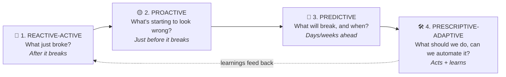
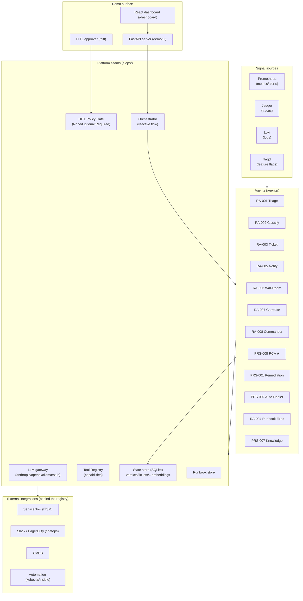
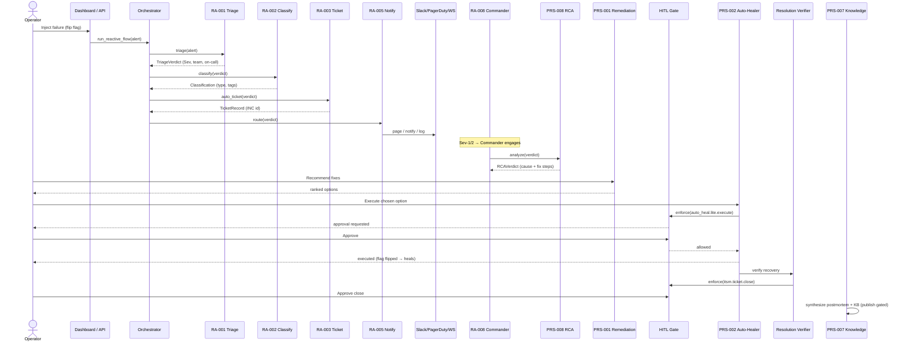
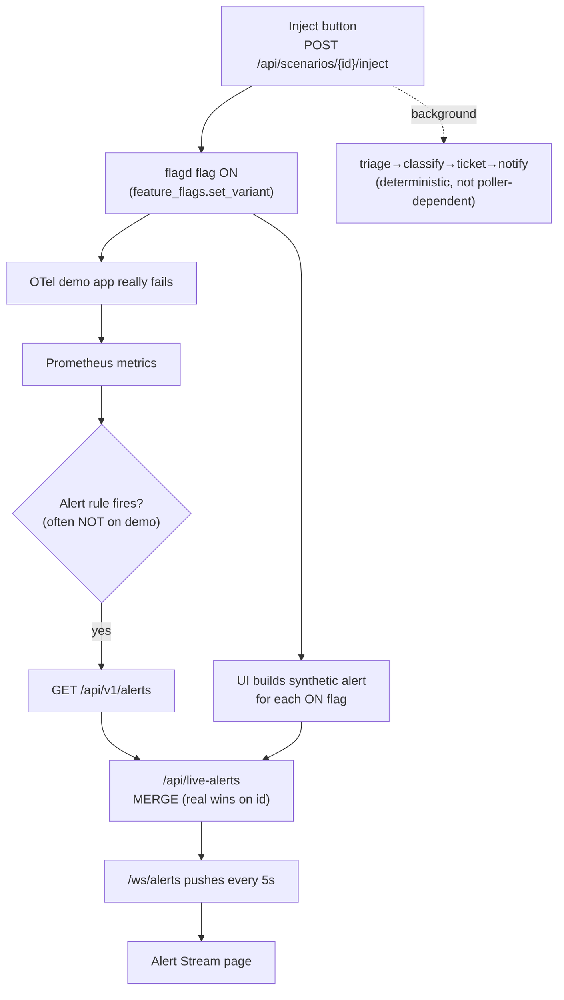
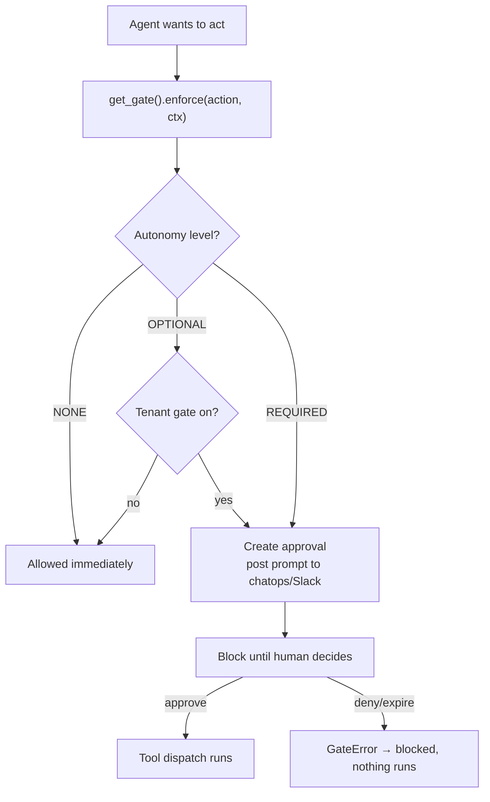
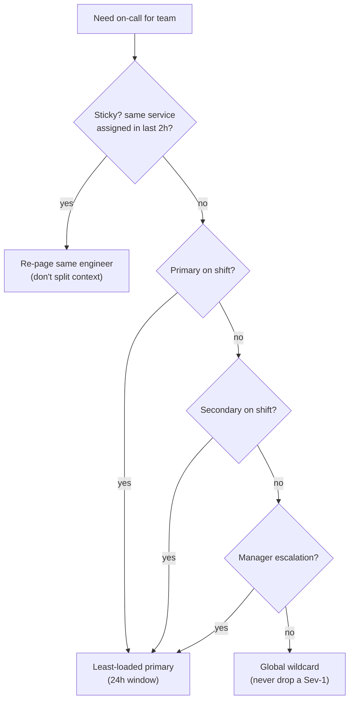

# Adaptive AIOps + SRE Ops — Complete Project Overview

> **One document, everything about the project** — for executives, engineers, demo presenters, and new joiners.
> Written to be read top-to-bottom by a non-technical reader, with deep technical sections for engineers.
> Status notes are **honest**: where something is a demo shortcut, it says so.

---

## Table of contents

1. [The 30-second pitch (non-technical)](#1-the-30-second-pitch-non-technical)
2. [The problem we solve](#2-the-problem-we-solve)
3. [What the product is](#3-what-the-product-is)
4. [The 4 maturity stages (phases)](#4-the-4-maturity-stages-phases)
5. [The 30-agent catalog](#5-the-30-agent-catalog)
6. [The agents we have built (deep dive)](#6-the-agents-we-have-built-deep-dive)
7. [Architecture (the big picture)](#7-architecture-the-big-picture)
8. [The platform seams (aiops/) — in depth](#8-the-platform-seams-aiops--in-depth)
9. [End-to-end backend flow (complete)](#9-end-to-end-backend-flow-complete)
10. [The alert pipeline: inject → Prometheus → screen](#10-the-alert-pipeline-inject--prometheus--screen)
11. [Human-in-the-loop (HITL) gate](#11-human-in-the-loop-hitl-gate)
12. [Data model (what we store)](#12-data-model-what-we-store)
13. [Similarity / RAG / embeddings technique](#13-similarity--rag--embeddings-technique)
14. [On-call routing logic](#14-on-call-routing-logic)
15. [The technology stack](#15-the-technology-stack)
16. [The dashboard (frontend)](#16-the-dashboard-frontend)
17. [How to run & demo it](#17-how-to-run--demo-it)
18. [Metrics & KPIs](#18-metrics--kpis)
19. [Evaluation harness & CI](#19-evaluation-harness--ci)
20. [Design principles (non-negotiable)](#20-design-principles-non-negotiable)
21. [Security & secrets](#21-security--secrets)
22. [What's real vs. demo shortcuts (honest status)](#22-whats-real-vs-demo-shortcuts-honest-status)
23. [Repository layout](#23-repository-layout)
24. [Glossary](#24-glossary)
25. [Roadmap (what's next)](#25-roadmap-whats-next)

---

## 1. The 30-second pitch (non-technical)

When something breaks in IT today, an engineer juggles six tools and a lot of manual steps to figure out *what broke, how bad it is, who should fix it, and how.* It's slow, stressful, and error-prone — often at 3 a.m.

**Adaptive AIOps** is a team of **AI agents** that does that work automatically: it spots the problem, removes duplicate noise, opens the ticket, pages the right person, gathers the responders, **finds the root cause, proposes an executable fix, applies it after a human approves, and writes the postmortem** — then *learns* so it's faster next time.

It's **vendor-neutral** (plugs into the tools you already use), **modular** (buy one agent or all), and **safe** (a human approves anything risky — the system physically cannot bypass that gate).

---

## 2. The problem we solve

| Today's pain | What it costs |
|---|---|
| Alert storms — 50 alarms for 1 outage | Engineers drown in noise; real signal is lost |
| Manual triage — "what is this, how bad, who owns it?" | Slow acknowledgement (high **MTTA**) |
| Manual ticketing + paging | Repetitive toil, missed records |
| Root-cause hunting across dashboards | Slow resolution (high **MTTR**) |
| Tribal knowledge, no postmortems | Same incident repeats; no learning |
| Tools that only *diagnose* ("probably the DB") | Analysis ends in a to-do list, not a fix |

**Our wedge:** most tools stop at *"likely cause."* Ours produces an **executable fix with a tested rollback**, gated by human approval — analysis that ends in a *resolved incident*.

---

## 3. What the product is

**Adaptive AIOps + SRE Ops** — a vendor-neutral, multi-agent platform that automates IT operations across **four maturity phases**. The product is **30 modular agents**, each individually sellable, with a dedicated **RCA Agent** as the headline differentiator.

- **Vendor-neutral:** every external dependency (LLM, ticketing, monitoring, automation) sits behind a thin internal interface, so providers are swappable by config.
- **Modular:** each agent has a stable contract (inputs, outputs, KPI, HITL level). License one or all.
- **Safe:** Human-In-The-Loop (HITL) is enforced by the platform, not the agent — a buggy or compromised agent *cannot* run a destructive action without approval.
- **Open to third parties:** other tools/agents plug in via **MCP** (tools/data), **A2A** (agent-to-agent), and **OpenAPI** (REST).

---

## 4. The 4 maturity stages (phases)

The platform is a **maturity ladder** — the goal is to move *left over time*, from cleaning up disasters to preventing them.



**Health-care analogy:**
- **Reactive** = the ER (you're already sick — treat the emergency).
- **Proactive** = noticing early symptoms (a cough) before you're really ill.
- **Predictive** = a risk screen ("based on trends, you'll likely get X in 3 months").
- **Prescriptive-Adaptive** = the treatment plan the system can administer (with approval) and learn from.

| Stage | Question | When it acts | Example |
|---|---|---|---|
| **1. Reactive-Active** (8 agents) | "What just broke?" | After failure | *Payment is down now → triage, ticket, page, RCA, fix.* |
| **2. Proactive** (7 agents) | "What's starting to look wrong?" | Just before | *Payment latency crept up 15% over 3 days → warn now.* |
| **3. Predictive** (7 agents) | "What will break, and when?" | Days/weeks ahead | *"DB connections will exhaust next Tuesday 2 p.m. (90%)."* |
| **4. Prescriptive-Adaptive** (8 agents) | "What should we do — can we automate it?" | Acts + learns | *Rank fixes → approve → auto-heal → write postmortem.* |

**One incident through all four (the difference):**
1. **Predictive (1 week before):** *"Payment DB pool will exhaust during the sale."*
2. **Proactive (1 hour before):** *"Connection wait-times creeping up."*
3. **Reactive (the moment it breaks):** *"Payments failing — Sev-1."*
4. **Prescriptive (fix + learn):** *"Disable bad flag → approve → applied → recovered → postmortem."*

---

## 5. The 30-agent catalog

★ = headline differentiator. **Built** = working in this POC. SRE = the one SRE-specialist agent per phase.

### Phase 1 — Reactive-Active ("What just broke?")
| ID | Agent | HITL | Built? | KPI |
|---|---|---|---|---|
| RA-001 | Alert Triage | Optional | ✅ | MTTA reduction, noise suppression |
| RA-002 | Incident Classifier | Optional | ✅ | Classification accuracy, misroute rate |
| RA-003 | Auto-Ticketing | Optional | ✅ | Ticket automation %, accuracy |
| RA-004 | Runbook Executor | Required | ✅ | Auto-remediation success %, rollbacks |
| RA-005 | Notification Router | None | ✅ | Acknowledgement latency, escalation rate |
| RA-006 | War-Room Assembler | Optional | ✅ | Time-to-bridge, SME coverage % |
| RA-007 | Log Correlation | None | ✅ | MTTI reduction, evidence completeness |
| RA-008 | Incident Commander (SRE) | Optional | ✅ | Comms compliance %, postmortem cycle time |

### Phase 2 — Proactive ("What's starting to look wrong?")
| ID | Agent | Built? |
|---|---|---|
| PRO-001 | Anomaly Detector | 🔲 planned |
| PRO-002 | Drift Monitor | 🔲 planned |
| PRO-003 | Dependency Mapper | 🔲 planned |
| PRO-004 | Noise Reducer | 🔲 planned |
| PRO-005 | Early Warning | 🔲 planned |
| PRO-006 | Topology Discovery | 🟡 partial (live topology map exists) |
| PRO-007 | Toil Detector (SRE) | 🔲 planned |

### Phase 3 — Predictive ("What will break, and when?")
| ID | Agent | Built? |
|---|---|---|
| PRE-001 | Failure Forecaster | 🔲 planned |
| PRE-002 | Capacity Planner | 🔲 planned |
| PRE-003 | SLO Breach Predictor | 🔲 planned |
| PRE-004 | Seasonality Learner | 🔲 planned |
| PRE-005 | Root-Cause Predictor | 🔲 planned |
| PRE-006 | Change Impact Predictor | 🔲 planned |
| PRE-007 | Reliability Forecaster (SRE) | 🔲 planned |

### Phase 4 — Prescriptive-Adaptive ("What should we do?")
| ID | Agent | HITL | Built? | KPI |
|---|---|---|---|---|
| PRS-001 | Remediation Recommender | Required | ✅ | Recommendation acceptance %, success rate |
| PRS-002 | Auto-Healer | Required | ✅ | Auto-heal success rate, unintended impact |
| PRS-003 | Policy Optimizer | Required | 🔲 planned | Policy-improvement rate |
| PRS-004 | Feedback Learner | Required | 🔲 planned | Model-improvement cadence |
| PRS-005 | Cost-Aware Scaler | Optional | 🔲 planned | $ saved/month |
| PRS-007 | Knowledge Synthesizer | Required | ✅ | KB coverage %, grounding rate |
| PRS-006 | Chaos Orchestrator (SRE) | Required | 🔲 planned | Chaos coverage % |
| **PRS-008** | **RCA Agent ★** | Required | ✅ | RCA accuracy, fix-step acceptance, MTTR reduction |
| — | Resolution Verifier (companion) | Required | ✅ | post-fix verification, ticket-close |

**POC scope:** ~12 agents built end-to-end across a full **Reactive → Prescriptive** loop. Proactive & Predictive are designed (catalog + KPIs) but mostly stubbed — they are the next phase.

---

## 6. The agents we have built (deep dive)

Each agent is a standalone unit. It receives a structured input, does its job, and emits a structured, audited output. They couple **only** through these declared schemas.

### RA-001 Alert Triage — the front door
- **Does:** raw alarm → clean incident verdict (what broke, severity, owner).
- **8 steps:** validate → normalize → de-dupe → correlate (metrics+traces) → severity → ownership → summary → save verdict.
- **Output:** `TriageVerdict` (service, severity, confidence, summary, team, on-call engineer, runbook hint, duplicate count, audit trace).
- **Method:** rule-based + embeddings/cosine for near-duplicate dedup + LLM for severity/summary; tool lookups for metrics/traces/CMDB/on-call.
- **HITL:** Optional (read-only).

### RA-002 Incident Classifier — what *kind* of problem
- **Does:** decides incident type (infrastructure / application / network / external-dependency / change-related) by comparing to past incidents.
- **4-tier ladder:** similar history (no LLM) → LLM with retrieved examples → LLM cold → keyword fallback. **Learns** by saving each new incident.
- **Output:** `Classification` (type, confidence, root-cause hint, tags, similar incident IDs).
- **HITL:** Optional. Has its own dashboard at `/classifier`.

### RA-003 Auto-Ticketing — the paper trail
- **Does:** opens/updates the ITSM ticket (ServiceNow) with full context + a Grafana chart attachment for key alerts.
- **Output:** `TicketRecord` (created, ticket_id, system, urgency, channel notified).
- **Safety:** skips duplicates (no spam tickets); if ServiceNow errors, still pings chat so humans see it.
- **HITL:** Optional.

### RA-004 Runbook Executor — the safe automation
- **Does:** picks the right runbook, dry-runs every step, executes in order, **rolls back on failure**.
- **Routing:** safe step → runs autonomously; **destructive step → human approval gate**; fail-closed (un-marked steps treated as dangerous).
- **Output:** `RunbookExecution` (per-step records, status resolved/rolled_back/denied/failed/no_runbook, rollback artifacts).
- **HITL:** Required (on destructive steps). Now backed by **real runbook files** (`agents/runbook_executor/runbooks/*.md`).

### RA-005 Notification Router — the smart dispatcher
- **Does:** decides **page / notify / log** (by severity + business hours), picks the team channel + on-call person, writes the message, sends it, DMs the assignee.
- **Output:** `RoutingDecision` (response_mode, channel, assignee, sub-domain, actions, audit).
- **Sinks:** WebSocket (dashboard), Slack channel + bot DM, PagerDuty, JSONL audit log.
- **HITL:** None.

### RA-006 War-Room Assembler — gather the responders
- **Does:** for Sev-1/Sev-2, stands up a war-room channel + join link, invites the on-call SME, posts a live context pack (metrics+traces), seeds the timeline.
- **Output:** `WarRoomAssembly` (channel, invited SMEs, context pack, timeline, bridge/meeting URLs).
- **HITL:** Optional. (Real Slack channel + Jitsi meeting; simulates if no token.)

### RA-007 Log Correlation — one timeline from three signals
- **Does:** pulls logs + traces + metrics for the incident window, lays them on one timeline, names the suspect component using the dependency map.
- **Output:** `CorrelationResult` (summary, timeline, top signatures, suspected dependencies, confidence). Feeds RCA.
- **HITL:** None. (Real data when cluster up; clearly-labelled synthetic fallback offline.)

### RA-008 Incident Commander (SRE) — the coordinator
- **Does:** for Sev-1/Sev-2, runs the whole reactive chain + RCA in one call, scribes a timeline, posts an IC briefing, requests a human-IC handoff, seeds a postmortem.
- **Output:** `IncidentCommandResult` (engaged, reactive bundle, RCA, timeline, postmortem seed, handoff).
- **HITL:** None (orchestration only — never executes a fix).

### PRS-008 RCA Agent ★ — the differentiator
- **Does:** triage verdict → **root cause + ranked executable fix steps**, each with blast radius + tested rollback, all **human-gated**.
- **Method:** LLM reasoning (Claude Sonnet 4.6) over the verdict (+ optional correlation evidence); deterministic safe fallback for the locked demo scenario; refuses to confidently guess otherwise.
- **Output:** `RCAVerdict` (root_cause, ranked_fix_steps with `requires_hitl=true` always, confidence).
- **HITL:** Required on every fix step.

### PRS-001 Remediation Recommender — the options menu
- **Does:** RCA verdict → **ranked menu** of reversible fix options (blast radius, confidence, MTTR estimate, rollback, the tool that runs it). Safest-first, explainable.
- **Method:** deterministic scoring (Day-1, no LLM): RCA steps + a symptom playbook, scored by blast radius + confidence + proven-rollback.
- **HITL:** Required (executes via Auto-Healer).

### PRS-002 Auto-Healer — the hands (executor)
- **Does:** takes one chosen option → validates → **human gate** → dry-run (default) or **live** execution → records outcome.
- **Output:** `ExecutionVerdict` (status refused/blocked/pending/dry_run_ok/executed/failed, gate decision, tool result, audit). Every attempt saved to `ExecutionRow`.
- **HITL:** Required. Live flag-flips genuinely heal; other actions advisory until wired.

### PRS-007 Knowledge Synthesizer — the learning loop
- **Does:** resolved incident → drafts postmortem + suggests a runbook + a KB article (PII-redacted), de-duplicated, held for human approval.
- **Method:** LLM draft + fallback; embedding/Jaccard dedup; **REQUIRED-HITL** to publish.
- **Output:** `SynthesisResult` (postmortem, runbook suggestion, KB article, dedup decision).

### Resolution Verifier (companion)
- **Does:** after a fix, re-runs detection checks across a stabilization window (1m/3m/5m), attaches proof to the ticket, raises the ticket-close approval.

---

## 7. Architecture (the big picture)



**The Agentic AI Runtime** (the conceptual engine) has six parts: **Planner, Router, Orchestrator, Memory, Tool Registry, Eval Harness.** In this POC the load-bearing ones are the **Orchestrator** (`aiops/runtime`), **Tool Registry** (`aiops/tools`), **Memory** (`aiops/state` — embeddings + history), and the **Eval Harness** (`evals/`).

**Golden rule:** agent code never calls a vendor SDK directly. It calls a **capability** (e.g. `get_registry().call("itsm.incident.create", ...)`) and the platform decides which provider runs it. This is what makes the whole thing vendor-neutral and individually sellable.

---

## 8. The platform seams (`aiops/`) — in depth

`aiops/` is the platform layer. **Vendor SDKs may only be imported inside these seams** (a smoke test enforces it).

| Seam | Package | What it is |
|---|---|---|
| **LLM gateway** | `aiops/llm` | Provider-agnostic `complete()` / `acomplete()`. Backends: Anthropic, OpenAI/Azure, Ollama (local), `stub` (offline/CI). Per-agent override (RCA uses Claude Sonnet 4.6). |
| **Tool Registry** | `aiops/tools` | Every external action is a **capability string** with one or more providers. `get_registry().call(capability, **kwargs)` → `ToolResult{ok,data,error,metadata}`. HITL is enforced at this call boundary. |
| **Policy / HITL gate** | `aiops/policy` | `get_gate().enforce(action, ctx)` — 25 capabilities mapped to None/Optional/Required. Approval registry + approver. |
| **Runtime / Orchestrator** | `aiops/runtime` | `run_reactive_flow(alert)` chains RA-001→002→003→005 with FK guards + soft-fail. |
| **State / Memory** | `aiops/state` | SQLite via SQLModel: verdicts, clusters, tickets, notifications, classifications, historical incidents (embeddings), KB articles (embeddings), RCA results, executions, engineers/shifts/categories/expertise. |
| **Runbooks** | `aiops/runbooks` | File-backed runbook library (markdown + YAML frontmatter), review status, versioning. |
| **Chatops** | `aiops/tools/chatops` | `ChatMessage` → fan-out adapters: WebSocket (dashboard), JSONL audit, Slack (webhook + bot DM), PagerDuty. |
| **ITSM** | `aiops/tools/itsm` | ServiceNow client (incident CRUD, CMDB lookup) with a built-in demo CMDB fallback table. |
| **Observability** | `aiops/tools/observability` | Prometheus (`/api/v1/query`, `/api/v1/alerts`), Jaeger (traces/services), Grafana (panel render), Loki (logs). |
| **Feature flags** | `aiops/tools/feature_flags` | flagd adapter (set/get/list/reset variants) — the only sanctioned way to flip demo failures. |
| **Auth** | `aiops/auth` | Token/middleware package (bytecode-only in tree — confirm source isn't gitignored). |

### Capability → autonomy levels (the HITL map, 25 capabilities)
| Capability (sample) | Level |
|---|---|
| `observability.metrics.query/alerts`, `observability.traces.*`, `itsm.cmdb.lookup`, `oncall.schedule.lookup`, `notify.send`, `automation.runbook.simulate/apply`, `feature_flags.get_variant` | **NONE** |
| `itsm.incident.create/update`, `chatops.war_room.create`, `auto_heal.execute` | **OPTIONAL** |
| `automation.runbook.execute`, `rca.fix_step.execute`, `knowledge.publish`, `itsm.ticket.close`, `auto_heal.lite.execute`, `remediation.recommend`, `policy.optimize`, `feedback.promote_model`, predictive/chaos actions | **REQUIRED** |

---

## 9. End-to-end backend flow (complete)

The full Reactive → Prescriptive loop for one incident. Each step is real backend code; soft-fail means one stage breaking doesn't kill the rest.



**What happens in code, step by step:**
1. **Inject** (`POST /api/scenarios/{id}/inject`) flips a flagd flag on → app fails → also fires the triage chain in the background.
2. **Orchestrator** `run_reactive_flow(alert)` runs triage → classify → ticket → notify, persisting each (with foreign-key guards), soft-failing routing.
3. **Notification** fans out through the chatops seam to all sinks; persists a `NotificationRow`.
4. **Incident Commander** (Sev-1/2) re-runs the flow + RCA, scribes a timeline, posts a briefing, seeds a postmortem.
5. **RCA** produces the root cause + ranked executable fix steps (all `requires_hitl=true`).
6. **Remediation Recommender** turns RCA into a ranked options menu.
7. **Auto-Healer** executes the chosen option through the **REQUIRED HITL gate** (async on a pool thread → approval id → poll outcome). Dry-run by default; live flips the flag.
8. **Resolution Verifier** re-checks recovery, then raises the ticket-close approval.
9. **Knowledge Synthesizer** drafts the postmortem + KB article (publish gated).

---

## 10. The alert pipeline: inject → Prometheus → screen



**Why two paths?** The demo's OTel app leaves spans `STATUS_CODE_UNSET`, so the real error-rate rules often don't fire. The UI therefore **synthesizes an alert per active flag** and merges it with real Prometheus alerts (real wins). In production, you'd rely on real Prometheus alerts alone. Prometheus is queried over HTTP: `GET {PROMETHEUS_URL}/api/v1/alerts` (firing alerts) and `/api/v1/query` (PromQL).

---

## 11. Human-in-the-loop (HITL) gate

**Principle:** HITL is **platform-enforced, not agent-enforced.** A buggy or compromised agent physically cannot run a Required action without approval, because the "do it" line is unreachable until the gate clears.



- **Levels:** NONE (always allowed) · OPTIONAL (allowed unless tenant gate is on) · REQUIRED (always needs an approver; fail-closed by default).
- **Approval surfaces:** the `/hitl` web console (same-origin auth) and **Slack interactive buttons** (HMAC-signed).
- **Async pattern:** demo executors fire on a pool thread, return an `approval_id` immediately, and the UI polls the outcome — so the browser never blocks for the approval window.

---

## 12. Data model (what we store)

SQLite (via SQLModel) — `data/state.db`. Three tables carry **embedding vectors** (the RAG store).

| Table | Stores | Embedding? |
|---|---|---|
| `verdicts` | RA-001 triage verdicts (severity, team, on-call, dup count, audit) | — |
| `clusters` | dedup clusters with running **centroid** vector | ✅ |
| `tickets` | RA-003 ITSM tickets (external id, system, state) | — |
| `notifications` | RA-005 routing (channel, response_mode, actions) | — |
| `classifications` | RA-002 incident type, confidence, tags | — |
| `historical_incidents` | similarity seed for RA-002 | ✅ |
| `kb_articles` | PRS-007 KB articles (status, approval) | ✅ |
| `rca_results` | PRS-008 RCA verdicts by incident | — |
| `executions` | PRS-002 auto-heal attempts (status, tool, decision) | — |
| `engineers` / `shifts` / `failure_categories` / `engineer_expertise` | on-call roster + schedules + domain expertise | — |

**Live snapshot (from a recent `state.db`):** 91 verdicts, 101 notifications, 136 classifications, 32 executions, 4 KB articles, 137 historical incidents, 5 engineers, 189 shifts.

---

## 13. Similarity / RAG / embeddings technique

Used by RA-002 (find similar incidents), RA-001 (de-dupe near-identical alerts), PRS-007 (KB dedup).

- **Embeddings:** `sentence-transformers/all-MiniLM-L6-v2` → a **384-number vector** capturing *meaning*.
- **Comparison:** vectors are L2-normalized, so **cosine similarity = dot product** (0 → 1; 1 = identical meaning).
- **Search:** brute-force top-K over vectors stored as JSON in SQLite.
- **Classifier thresholds:** Top-K = 5; min similarity 0.60; **tier-1 confident** = 0.85 *and* top-3 agree (no LLM needed).
- **Dedup (RA-001):** cosine ≥ 0.85 merges into one cluster; the cluster centroid updates slowly (EMA, α=0.2) to stay stable.
- **Fallbacks:** keyword match (classifier) / Jaccard word-overlap (KB) when embeddings unavailable.
- **Production upgrade:** swap SQLite brute-force for **pgvector or Qdrant** (same technique, purpose-built store).

**Example:** *"payment 5xx from gateway"* matches past *"payment gateway 503 errors"* (0.91) — meaning matches even though words differ; keyword search would miss it.

---

## 14. On-call routing logic

`find_oncall_for_team` / `find_best_for_team_and_category` — the ladder a human dispatcher would use:



Plus **expertise routing:** match alert keywords → failure sub-domain (e.g. *payment-gateway* vs *payment-database*) → pick the highest-scoring expert on shift (proficiency + track record + feedback + manual priority). **Auto-seeded on startup** so real names/emails appear (from `AIOPS_ONCALL_ROSTER_JSON`) instead of `oncall@…example.com`.

---

## 15. The technology stack

| Concern | Choice | Notes |
|---|---|---|
| Demo app | **OpenTelemetry Demo (Astronomy Shop)** | pre-instrumented, has feature flags for failures |
| Cluster | **Rancher Desktop k3s** (local) | no Docker on dev machines; cloud deferred |
| Metrics/Logs/Traces | **Prometheus / Loki / Tempo + Grafana**, **Jaeger** | all FOSS |
| Instrumentation | **OpenTelemetry** | vendor-neutral |
| Tickets | **ServiceNow PDI** (Jira secondary, planned) | demo CMDB fallback built-in |
| Chat / on-call | **Slack** + **PagerDuty** | bot DM + interactive approvals |
| Failure injection | **flagd feature flags** + Chaos Mesh | flags for easy, chaos for advanced |
| Load | **k6** | |
| LLM | **Anthropic Claude / OpenAI / Ollama / stub** | RCA pinned to Claude Sonnet 4.6 |
| Vector store | **SQLite (POC)** → pgvector/Qdrant | brute-force cosine today |
| Policy | **OPA** (`policies/hitl.rego`) | policy-as-code |
| Backend | **FastAPI** (`demo/ui`, port 8765) | + WebSockets |
| Frontend | **React + Vite + Tailwind** (`demo/dashboard`) | built into `dist/`, served at `/dashboard` |
| CI | **GitHub Actions** | ruff + pytest + eval gate + OPA check |
| Pkg mgmt | **uv** | |

---

## 16. The dashboard (frontend)

React SPA at `/dashboard`. ~17 pages across three areas:

- **Landing / Agent browser:** Landing, Agents catalog, AgentDetail (per-agent intro + "Try it" + vendor-neutral config picker), SreOps, Integrations.
- **Operations Console (`/console/*`):** Overview (inject failures), Alert Stream, RCA Console, Incident Commander, War Room, Approvals, Notifications, Reasoning, Knowledge, Topology, System Health.
- **Per-agent live surfaces (`/agents/*`):** Runbook Executor, **Remediation Recommender**, **Auto-Healer** (the last two added in PR #186, with a dry-run/live toggle).
- **Standalone apps:** `/classifier` (RA-002 SPA), `/hitl` (approver console).

The dashboard talks to ~59 HTTP routes + 2 WebSockets (`/ws/alerts`, `/ws/chatops`). The sidebar is **agent-scoped** — each agent shows only its relevant surfaces (modularity in the UI).

---

## 17. How to run & demo it

```powershell
uv sync --extra dev ; uv sync --extra ui          # install
.\infra\bootstrap.ps1                              # deploy OTel demo into k3s (one-time)
.\start.ps1                                        # port-forwards + build dashboard + start UI :8765
# open http://localhost:8765/dashboard
.\stop.ps1                                         # tear down
```

**VP demo (one incident, ~6 min):** Overview → **Inject payment failure** (Triage) → **Notifications** (ticket + page) → **War Room** (responders gather) → **RCA** → *Approve & apply* (heal) → **Knowledge** (postmortem). Close on: *detect → fix → learn, mostly automatic, human in control.*

---

## 18. Metrics & KPIs

### Platform target SLOs (from `KPI.md` / Solution Design slide 12)
| Metric | Target |
|---|---|
| **MTTA** (acknowledge) | < 2 min (Sev-1/2) |
| **MTTR** (resolve) | −40% to −55% vs baseline |
| **MTTD** (detect) | < 90 s |
| Alert noise reduction | −60% to −75% |
| Notification deliverability | ≥ 99% |
| HITL approval time | median < 60 s, p95 < 5 min |
| RCA pass rate | ≥ 0.6 (v0) → ≥ 0.75 |

### What's actually measured today (honest)
- **MTTR / MTTA / MTTD are NOT yet computed** — we don't capture per-incident acknowledge/resolve timestamps (no PagerDuty ack webhook; tickets table empty in offline runs). They are **targets**, not measurements.
- **Computable from real `state.db` data right now:** noise reduction ≈ **35.9%** (142 alerts → 91 incidents — below target because demo injects hit distinct services), triage confidence **0.92**, classifier confidence **0.87**, auto-heal gate-pass **47%** (4 live executions), routing mix (page 35 / log 38 / notify 15).
- **To start measuring MTTR/MTTA:** add `alert_fired_at`, `acknowledged_at`, `resolved_at`, persist approval `decided_at`, and one aggregation endpoint. ~1 day of work.

---

## 19. Evaluation harness & CI

- **Every agent ships an eval golden set** (`agents/<name>/evals/golden.json`) — ~1,500 cases across 12 agents.
- **Truth files** (`demo/truth_files/*.yaml`) define ground truth per scenario (what broke, real cause, correct fix).
- **Harness** (`evals/harness.py`) scores each case; `pass_rate = passed/total`.
- **CI** (`.github/workflows/ci.yml`): `ruff check` + `ruff format --check` + `pytest` + **eval gate `--min-pass-rate 0.85`** + `opa fmt/check`.
- **57 test files** with **7 autouse hermetic fixtures** (isolate DB, gate approver, LLM provider, Jaeger circuit, chatops hub, Slack/roster env, auto-triage/watcher/auto-seed).

---

## 20. Design principles (non-negotiable)

1. **Vendor-neutral by default** — wrap every external dependency behind a seam; ≥2 alternatives each.
2. **Modular & individually sellable** — stable per-agent contracts; license-one or license-all.
3. **HITL is platform-enforced** — never inside agent logic; the gate cannot be bypassed.
4. **Policy-as-code** — every action passes a declarative policy layer (OPA), reviewed in Git.
5. **Safe autonomy as primitives** — dry-run, simulation, blast-radius caps, circuit breakers, tested rollback.
6. **Closed-loop learning** — versioned models/prompts/policies; shadow-eval before promotion; auto-rollback on regression.
7. **Eval harness from day one** — a prompt change is a model change; re-run evals.
8. **Truth files for every scenario** — grade on ground truth, not vibes.

---

## 21. Security & secrets

- **No real secrets in git.** Real emails / Slack IDs / tokens live in `.env` (gitignored) and `.env.shared` (encrypted at rest with **git-crypt**). Committed defaults use `@example.com` placeholders + `UPLACEHOLDER…` IDs.
- **On-call identities** come from `AIOPS_ONCALL_ROSTER_JSON` (env) — never hardcoded.
- **HITL & policy** ensure no destructive action runs without human approval.
- **Prompt-injection defense** in agents (sanitize values, validate inputs, PromQL escaping).
- **Approval auth:** same-origin for the web console; HMAC-signed Slack callbacks; bearer token for cross-origin.

---

## 22. What's real vs. demo shortcuts (honest status)

| Area | Real / built | Demo shortcut (because the toy app limits us) |
|---|---|---|
| Alert source | Prometheus query path is real | We **synthesize** an alert per active flag (OTel spans stay `STATUS_CODE_UNSET`, so real rules don't fire) |
| Severity | Rule + LLM logic is real | Demo-critical flags are **force-mapped** to a severity (no real error metrics) |
| Dedup / similarity | Embeddings + cosine + clustering real | Stored in **SQLite brute-force**, not pgvector/Qdrant; embeddings off in tests |
| Ticketing | ServiceNow integration real | Jira not built; "update existing ticket" mostly create-only; tickets table empty if SNOW unconfigured |
| On-call | DB roster + sticky/load/expertise real, auto-seeded | Real emails need `AIOPS_ONCALL_ROSTER_JSON`; PagerDuty live ack not wired |
| Runbook execution | Workflow, gate, rollback real; real runbook files (#187) | Some step executors mocked depending on action |
| RCA | LLM reasoning + executable flag-fix real | Confident only on the injectable flag scenarios; deterministic fallback for the locked scenario; no own RAG yet |
| Auto-Healer | Validate + gate + live flag-flip + audit real | Only flag-flips truly execute; scale/restart/rollback advisory; no auto-watch/auto-rollback yet |
| War Room | Real Slack channel + Jitsi link | Invites on-call only (not yet CMDB/dependency owners) |
| Log Correlation | Real multi-signal correlation | Synthetic fallback offline; rules-based (not ML) |
| Incident Commander | Real orchestration + RCA + timeline | Correlation step is a placeholder; timed comms-cadence + status-page deferred |
| MTTR/MTTA | Targets documented | Not measured (no ack/resolve timestamps captured) |

---

## 23. Repository layout

```
aiops/                 # platform seams — vendor SDKs only here
├── llm/               # provider-agnostic LLM gateway
├── tools/             # tool registry + providers (chatops, itsm, observability, feature_flags, oncall)
├── policy/            # HITL gate + approval registry
├── runtime/           # orchestrator (run_reactive_flow)
├── state/             # SQLite models + repository (memory/RAG)
├── runbooks/          # file-backed runbook store
└── auth/              # token/middleware
agents/                # the agents (RA-00x, PRS-00x), each with models + evals/golden.json
evals/                 # eval harness + reports
demo/
├── ui/                # FastAPI server (server.py, knowledge_routes.py, chatops_ws.py)
├── dashboard/         # React + Vite + Tailwind SPA
├── classifier-ui/     # standalone RA-002 SPA
├── scenarios/         # injectable failure scenarios (YAML)
├── truth_files/       # ground truth per scenario
├── failure_injection/ # CLI injector
└── audit/             # chatops.jsonl audit log
infra/                 # k3s bootstrap + Prometheus rules
policies/              # OPA policies (hitl.rego)
tests/                 # 57 test files + conftest hermetic fixtures
docs/                  # authoritative design docs (pptx/xlsx/docx)
.github/workflows/     # CI
start.ps1 / stop.ps1   # one-command bring-up / tear-down
```

Key docs: `CLAUDE.md` (build guide), `PRD.md`, `KPI.md`, `ONBOARDING.md`, `DEMO_PLAN.md` / `DEMO_SHOWCASE.md`.

---

## 24. Glossary

- **MTTA / MTTR / MTTD / MTBF** — Mean Time To Acknowledge / Resolve / Detect / Between Failures.
- **SLI / SLO / SLA** — measurable indicator / internal target / customer contract.
- **HITL** — Human-In-The-Loop (None / Optional / Required gating).
- **RCA** — Root-Cause Analysis.
- **Blast radius** — how much damage an action could do if wrong.
- **Runbook** — step-by-step fix procedure.
- **CMDB / CI** — Configuration Management Database / Configuration Item.
- **RAG** — Retrieval-Augmented Generation (find relevant context, then reason).
- **MCP / A2A / OpenAPI** — the three open contracts third parties plug in through.
- **Toil** — repetitive manual automatable work; SRE's named enemy.
- **PDI** — ServiceNow Personal Developer Instance.
- **flagd** — the feature-flag service used to inject demo failures.

---

## 25. Roadmap (what's next)

1. **Measure MTTR/MTTA/MTTD live** — capture fire/ack/resolve timestamps + an aggregation dashboard tile.
2. **Build Proactive (Stage 2)** — Anomaly Detector, Drift Monitor, Dependency Mapper, Early Warning.
3. **Build Predictive (Stage 3)** — Failure Forecaster, Capacity Planner, SLO Breach Predictor.
4. **Real vector store** — pgvector/Qdrant in place of SQLite brute-force.
5. **RCA's own retrieval** — feed it logs/traces/history (RAG) instead of just the verdict.
6. **More executable fixes** — wire scale / restart / deploy-rollback so Auto-Healer can run them.
7. **Auto-watch + auto-rollback** in Auto-Healer; **Jira** ticketing; **live PagerDuty** ack.
8. **Replace demo shortcuts** — real alert rules + metric-derived severity once on a richer app.

---

*This document is a living overview. When the catalog (`docs/Adaptive_AIOps_Agent_Catalog.xlsx`) or the code changes, update this file to match. The `docs/` design files remain the authoritative source for agent contracts and architecture.*
