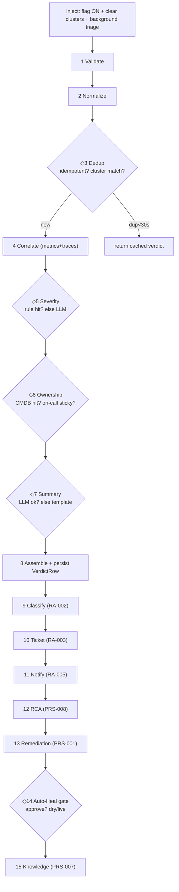

# Agent Execution Analysis — step-by-step trace (technical review)

> **Subject of analysis:** one concrete execution — an operator injects a *payment failure*, and the platform runs the full **Reactive → Prescriptive** flow. The deep core is **RA-001 Alert Triage's 8 internal stages** (the richest single-agent run); downstream agents are then traced as subsequent steps.
> **Audience:** senior engineer / technical reviewer.
> **Format per step:** *what · why · inputs · outputs · tools/functions · effect on next decision · assumptions & issues.*
> Companion to [CODEBASE_INTERNALS.md](CODEBASE_INTERNALS.md) (the function-level reference).

---

## 0. The trigger & the concrete input

**Trigger:** `POST /api/scenarios/payment_failure/inject` → flips flagd `paymentFailure → on`, clears the service's dedup clusters, marks the synthetic alert id seen, and submits `_triage_injected_scenario` to a background task.

**Synthetic alert handed to the agent** (`_synthetic_alert_for_scenario`):
```json
{
  "alert_id": "PROM-PaymentErrorRateHigh-na",
  "service": "payment",
  "metric": "PaymentErrorRateHigh",
  "value": 1.0,
  "timestamp": "2026-06-24T14:02:11Z",
  "source": "Prometheus",
  "severity_hint": "critical",
  "labels": {"alertname":"PaymentErrorRateHigh","service":"payment","severity":"critical",
             "scenario_id":"payment_failure","flag":"paymentFailure","synthetic":"true"},
  "annotations": {"summary":"Payment failure injected","description":"flag=paymentFailure active"}
}
```

## Execution flow (with decision points ◇)



---

# Part A — RA-001 Alert Triage (the 8 stages, deep)

### Step 1 — Validate
- **What:** constructs a Pydantic `Alert` from the raw payload.
- **Why:** fail at the boundary, not deep in PromQL interpolation. Empty `service`, NaN `value`, or bad timestamp are rejected here.
- **Inputs:** raw alert dict.
- **Outputs:** a validated `Alert` object (or `ValidationError`).
- **Tools/functions:** `Alert(...)` field validators (`_require_nonempty_identifier`, `_must_be_finite`, `_coerce_timestamp`).
- **Effect on next:** guarantees every later stage has clean fields; `cluster_key()` becomes computable.
- **Assumptions/issues:** assumes the synthetic payload is well-formed (it is, by construction). For *real* Alertmanager payloads, a source adapter must normalize first (Step 2).

### Step 2 — Normalize
- **What:** ensures the alert is in the canonical internal shape.
- **Why:** decouple the pipeline from the source vendor (Datadog/CloudWatch/Prometheus word alarms differently).
- **Inputs:** the validated `Alert`.
- **Outputs:** the same canonical `Alert` (here a no-op — the synthetic payload is already canonical).
- **Tools/functions:** source adapters in `aiops/tools/alerts/*` (not exercised on the synthetic path).
- **Effect on next:** dedup/severity logic is source-agnostic.
- **Issues:** ⚠️ in the demo the synthetic alert *is* the canonical shape, so adapters are untested on this path — a real-source bug wouldn't show here.

### Step 3 — Dedup ◇ (decision point)
- **What:** decides if this is a repeat (ignore), a known incident (merge), or new (create a cluster).
- **Why:** kill alert-storm noise — one incident, not fifty.
- **Inputs:** `Alert.cluster_key()` (sha1 of service+metric+labels), `alert_id`, optional embedding vector.
- **Outputs:** a `_DedupHit{cluster_key, source_alerts, duplicate_count, is_new}`.
- **Tools/functions:** `find_recent_verdict_by_alert_id(30s)` (idempotency), `find_active_cluster(5m)`, embedding cosine ≥ 0.85, `upsert_cluster` (EMA centroid α=0.2). Embedding model `all-MiniLM-L6-v2` (lazy; **disabled in tests/CI**).
- **Decision branches:**
  | Condition | Outcome |
  |---|---|
  | same `alert_id` within 30 s | return cached verdict, **pipeline short-circuits** |
  | `cluster_key` matches active cluster, or cosine ≥ 0.85 | merge → `duplicate_count++` |
  | none | **new cluster** |
- **This run:** inject *cleared the cluster first*, so → **new cluster, `duplicate_count = 1`**.
- **Effect on next:** `duplicate_count` and `source_alerts` flow into the verdict's audit metadata.
- **Assumptions/issues:** ⚠️ in the demo a single synthetic alert never demonstrates the storm-merge; that only fires when multiple real alerts share the key. Embeddings being off in CI means *only* rule-based dedup is tested there.

### Step 4 — Correlate
- **What:** enriches the bare alert with live metrics + traces.
- **Why:** "payment is broken" → "payment error rate elevated, 3 failing traces" — context for severity + summary + downstream RCA.
- **Inputs:** `Alert.service`, time window.
- **Outputs:** `metrics_ctx`, `traces_ctx` (possibly empty).
- **Tools/functions:** `get_registry().call("observability.metrics.query", ...)` + `("observability.traces.search", ...)`, run in parallel via `ThreadPoolExecutor`. Real HTTP to Prometheus `/api/v1/query` and Jaeger.
- **Decision branch:** backend reachable → real context; unreachable (laptop, no cluster) → `ToolResult(ok=False)` → **graceful degrade**, context omitted.
- **Effect on next:** richer context biases the LLM summary; absence does not block the verdict.
- **Assumptions/issues:** ⚠️ conftest pins these URLs to `127.0.0.1:1` so tests fail fast; on a dev box without the cluster, this step is usually empty — the verdict is still produced.

### Step 5 — Severity classify ◇ (decision point)
- **What:** assigns Sev-1…Sev-3 with a confidence.
- **Why:** urgency drives everything downstream (page vs notify, war-room, IC engagement).
- **Inputs:** `severity_hint`, `threshold`/`value` ratio, metric name, customer-facing set, demo flag map.
- **Outputs:** `(severity, confidence)`.
- **Tools/functions:** `_classify_severity_rule_based(alert)` → if `(None, 0.5)` then `_classify_severity_llm(alert)` (Claude).
- **Decision branches:**
  | Branch | Trigger | Result |
  |---|---|---|
  | demo flag override | `labels.alert_type == "scenario_active"` + flag in map | forced Sev (gauge-alert path) |
  | **severity_hint** | `"critical"` in hint | **Sev-1, conf 0.95** ← *this run* |
  | threshold ratio | `value/threshold ≥ 2` + customer-facing | Sev-1 |
  | CPU/mem heuristic | metric contains cpu/memory | Sev-1/2 |
  | LLM consult | rules returned `(None, 0.5)` | LLM verdict (parsed via regex) |
- **This run:** `severity_hint="critical"` → **rule-based Sev-1, LLM skipped** (cheap, deterministic).
- **Effect on next:** Sev-1 → RA-005 will **page**, RA-006 **assembles a war room**, RA-008 **engages**.
- **Assumptions/issues:** ⚠️ **biggest honest caveat** — the Sev-1 comes from a *pre-set* `severity_hint`, not measured error rate. In production severity must derive from real metrics. This is a demo shortcut (the OTel app emits no error spans).

### Step 6 — Ownership ◇ (decision point)
- **What:** resolves the owning team + the on-call engineer + a runbook hint.
- **Why:** route to the *right* real person, not a generic bucket.
- **Inputs:** `Alert.service`, the resolved `team`.
- **Outputs:** `team`, `assigned_engineer` (email), `recommended_runbook`.
- **Tools/functions:** `call("itsm.cmdb.lookup", service="payment")` then `call("oncall.schedule.lookup", team=..., service="payment")`.
- **Decision branches:**
  | Lookup | Hit | Miss |
  |---|---|---|
  | CMDB | SNOW row → team | **demo CMDB fallback** → "Payments Team" |
  | on-call | sticky (≤2 h)? → same engineer; else primary on shift, least-loaded | global wildcard (never drop) |
- **This run:** team = **Payments Team**; on-call = **Khushi Patil <khushi.patil@example.com>** (DB provider, auto-seeded; sticky empty on first inject → primary).
- **Effect on next:** `assigned_engineer` is the page target for RA-005 and the SME invite for RA-006.
- **Assumptions/issues:** real emails require `AIOPS_ONCALL_ROSTER_JSON`; without it, named placeholders. If the engineers table were empty, the mock would emit `oncall@payments.example.com` (the bug we fixed via startup auto-seed).

### Step 7 — Summary ◇ (decision point)
- **What:** writes a one-line human headline.
- **Why:** instant readability for responders.
- **Inputs:** alert + `metrics_ctx`/`traces_ctx`.
- **Outputs:** `alert_summary` string.
- **Tools/functions:** `aiops.llm.complete(...)` (Claude); guard rejects "summaries" that are just a severity token; **template fallback** if LLM down.
- **Decision branch:** LLM ok → generated; else → deterministic template.
- **This run:** *"Payment service error rate elevated — likely a payment failure (injected)."*
- **Effect on next:** copied into the verdict; reused by ticket description, notification body, RCA prompt.
- **Assumptions/issues:** ⚠️ LLM latency on the hot path (mitigated: inject runs the chain in a background task; the `/api/triage` axios timeout is 90 s).

### Step 8 — Assemble + persist
- **What:** builds `TriageVerdict` + `AuditMetadata` (full decision trace) and saves it.
- **Inputs:** all prior stage outputs.
- **Outputs:** `(TriageVerdict, verdict_id)`.
- **Tools/functions:** `state_repo.save_verdict(verdict, cluster_key, alert_id)` → `VerdictRow`.
- **Effect on next:** `verdict_id` is the **foreign key** that gates persistence of classification + notification downstream.
- **Assumptions/issues:** persistence is best-effort — a DB blip returns `verdict_id=None`, and the orchestrator then *skips* dependent persistence (soft-fail) rather than crashing.

**RA-001 output (the verdict):**
| field | value |
|---|---|
| affected_service | payment |
| severity | Sev-1 (conf 0.95) |
| alert_summary | "Payment service error rate elevated…" |
| assigned_team | Payments Team |
| assigned_engineer | Khushi Patil \<khushi.patil@example.com\> |
| duplicate_alert_count | 1 |
| status | Active |

---

# Part B — the downstream chain (multi-agent)

### Step 9 — RA-002 Incident Classifier
- **What/why:** decides incident *type* to route to the right specialists.
- **Inputs:** verdict + raw alert text.
- **Outputs:** `Classification{incident_type, confidence, tags, root_cause hint, similar_incident_ids}`.
- **Tools/functions:** embed → `nearest_historical_incidents(k=5, min_sim=0.6)` → **4-tier decide** → re-query CMDB; `save_historical_incident` (learns).
- **Decision ◇:** tier-1 (sim≥0.85 + top-3 agree, **no LLM**) → tier-2 (LLM+evidence) → tier-3 (LLM cold) → tier-4 (keyword).
- **This run:** matches seeded payment-gateway incidents → **`external_dependency`, conf ~0.91, tier-1**.
- **Effect on next:** type + tags feed ticket category + RCA context.
- **Issues:** small seeded history → a novel failure may drop to tier-3/4 with lower confidence.

### Step 10 — RA-003 Auto-Ticketing
- **What/why:** open the official record.
- **Inputs:** verdict (+ classification).
- **Outputs:** `TicketRecord{created, ticket_id, urgency}`.
- **Tools/functions:** `call("itsm.incident.create")` (continue on error), optional `render_panel`+`attachment.add`, `notify.send`.
- **Decision ◇:** Suppressed verdict → skip (no dup ticket). Sev-1 → **urgency 1 (High)**.
- **This run:** real `INC00…` if ServiceNow configured, else mock id.
- **Effect on next:** ticket id is carried into RCA-apply context so the Resolution Verifier can later close it.
- **Issues:** ⚠️ tickets table empty when SNOW unconfigured → ticket_id may be a mock; Jira not wired.

### Step 11 — RA-005 Notification Router
- **What/why:** tell the right person, right channel, right urgency.
- **Inputs:** verdict (severity + on-call), clock.
- **Outputs:** `RoutingDecision{response_mode, channel, assignee, actions}` + `deliveries`.
- **Tools/functions:** `decide()` (pure) → `get_client().send(ChatMessage)` → fan-out: jsonfile, websocket, slack (channel), slack_bot (DM), pagerduty.
- **Decision ◇:** Sev-1 → **`response_mode=page`**, `actions=[page_oncall, post_to_chat]`.
- **This run:** posts to `team-payments`, **DMs Khushi**, pages PagerDuty (severity ≥ P2).
- **Effect on next:** persisted `NotificationRow` (FK to verdict); deliveries map feeds the deliverability KPI.
- **Issues:** channel name is derived (`team-payments`) — must map to a real channel in a live workspace; business-hours window is fixed UTC.

### Step 12 — PRS-008 RCA Agent ★
- **What/why:** find the cause + an executable fix.
- **Inputs:** the verdict (optionally RA-007 correlation — *not yet wired in the IC path*).
- **Outputs:** `RCAVerdict{root_cause, ranked_fix_steps[], confidence}` (every step `requires_hitl=true`).
- **Tools/functions:** `aiops.llm.complete` (Claude Sonnet 4.6, JSON-mode) → `_extract_json_object` → validate → force HITL; `_fallback_verdict` for locked scenario.
- **Decision ◇:** LLM parseable → use it; else deterministic fallback (correct for `slow-product-catalog`; low-confidence "investigate" otherwise).
- **This run:** root cause = *"paymentFailure flag enabled"*; fix #1 = **`set_flag paymentFailure → off`** (blast low, rollback: re-enable), conf ~0.9.
- **Effect on next:** the `set_flag` step is the one the executor can actually run; others are advisory.
- **Issues:** ⚠️ no own retrieval/RAG yet; confident only on injectable-flag scenarios.

### Step 13 — PRS-001 Remediation Recommender
- **What/why:** turn RCA into a ranked, decision-ready menu.
- **Inputs:** RCA verdict (+ triage context, environment).
- **Outputs:** `RemediationVerdict{options[] (sorted), recommended_option_id}`.
- **Tools/functions:** **pure function** — `_option_from_rca_step` + `patterns_for_cause` (catalog) → composite score `(6−blast)*10 + conf*5 + rollback_bonus + env_bonus`.
- **Decision ◇:** safest-first; `auto_pick_eligible=False` (always human-picked).
- **This run:** #1 "Disable `paymentFailure`" (tool `feature_flags.set_variant`), #2 scale, #3 restart.
- **Effect on next:** the chosen option's `tool_capability`+`tool_args` flow straight into Auto-Healer.
- **Issues:** deterministic (no learning-from-history/cost yet); non-flag tool capabilities not wired.

### Step 14 — PRS-002 Auto-Healer ◇ (the gate)
- **What/why:** execute the chosen option — but only after human approval.
- **Inputs:** one `RemediationOption` + service + dry_run flag.
- **Outputs:** `ExecutionVerdict{status, decision, would_execute, tool_result}`; `ExecutionRow` persisted.
- **Tools/functions:** `_validate_option` → `get_gate().enforce("auto_heal.lite.execute", ctx)` → (dry) DRY_RUN_OK | (live) `call("feature_flags.set_variant", flag, variant=off)`.
- **Decision ◇ (the critical one):**
  | Branch | Result |
  |---|---|
  | invalid option | REFUSED (gate not reached) |
  | gate denied/expired | BLOCKED |
  | approved + dry_run | DRY_RUN_OK (would_execute=true) |
  | approved + live | EXECUTED → **flag flips, payment heals** |
- **This run (live):** approve in `/hitl` → **EXECUTED** → `paymentFailure → off` → recovery.
- **Effect on next:** triggers the Resolution Verifier (re-check + ticket-close approval).
- **Issues:** ⚠️ no auto-watch/auto-rollback inside the agent yet; only flag-flips truly execute.

### Step 15 — PRS-007 Knowledge Synthesizer
- **What/why:** learn from it.
- **Inputs:** resolved-incident bundle (verdict + RCA + ticket).
- **Outputs:** `SynthesisResult{postmortem, runbook_suggestion, kb_article(pending_review)}`.
- **Tools/functions:** LLM draft (+ template fallback) → redact PII → dedup (cosine/Jaccard) → `save_kb_article(pending_review)`; publish gated by `knowledge.publish` (REQUIRED).
- **Effect on next:** future RA-002 classifications + RCA get richer history (closed loop).
- **Issues:** redaction is regex-grade (not compliance-grade); publish needs human approval.

---

## Consolidated views

### Decision points (where the run could branch)
| # | Decision | Inputs | This run | Alternative paths |
|---|---|---|---|---|
| 3 | Dedup | cluster_key, alert_id, embedding | new cluster | idempotent short-circuit / merge |
| 5 | Severity | hint, ratio, flag map | rule-based Sev-1 | LLM consult |
| 6 | On-call | sticky/shift/load | primary (Khushi) | sticky re-page / wildcard |
| 7 | Summary | LLM availability | LLM | template fallback |
| 9 | Classifier tier | similarity scores | tier-1 (no LLM) | tier-2/3/4 |
| 10 | Ticket | status | create (Sev-1) | skip (Suppressed) |
| 11 | Routing | severity + hours | page | notify / log |
| 12 | RCA | LLM parseable | LLM verdict | deterministic fallback |
| 14 | Heal gate | approval + dry/live | EXECUTED | REFUSED / BLOCKED / DRY_RUN_OK |

### Tool / API interactions (the whole run)
| Step | Capability / function | Provider | Real/Mock | Effect |
|---|---|---|---|---|
| inject | `feature_flags.set_variant` | flagd | **Real (K8s SSA)** | flag ON |
| 4 | `observability.metrics.query` / `traces.search` | prometheus/jaeger | Real (HTTP) | context |
| 6 | `itsm.cmdb.lookup` | servicenow/mock | Real+fallback | team |
| 6 | `oncall.schedule.lookup` | db | Real (DB) | engineer |
| 5,7,12,15 | `llm.complete` | anthropic/stub | Real LLM | severity/summary/RCA/postmortem |
| 10 | `itsm.incident.create` | servicenow/mock | Real/Mock | ticket |
| 11 | `chatops` fan-out | slack/pagerduty/ws/jsonfile | Real | page/notify |
| 14 | `auto_heal.lite.execute` → `feature_flags.set_variant` | gate → flagd | Gated Real | heal |
| 12/14/15 | `rca.fix_step.execute` / `knowledge.publish` / `itsm.ticket.close` | seam | Gated Real | apply/publish/close |

### Data transformations (the shape of the data as it moves)
| Stage | In | Out |
|---|---|---|
| inject | scenario id | flagd mutation + synthetic `Alert` dict |
| RA-001 | `Alert` | `TriageVerdict` (+ `verdict_id`) |
| RA-002 | verdict + alert | `Classification` |
| RA-003 | verdict + classification | `TicketRecord` |
| RA-005 | verdict | `RoutingDecision` → `ChatMessage` → `DeliveryResult[]` |
| PRS-008 | verdict | `RCAVerdict` (ranked fix steps) |
| PRS-001 | RCA verdict | `RemediationVerdict` (ranked options) |
| PRS-002 | one option | `ExecutionVerdict` (+ `ExecutionRow`) |
| PRS-007 | resolved bundle | `SynthesisResult` (postmortem + KB) |

---

## Assumptions & potential issues (reviewer summary)

| Area | Assumption / risk | Severity |
|---|---|---|
| **Severity source** | Sev derived from a *pre-set hint / flag map*, not real error metrics (demo-only) | **High (for prod realism)** |
| **Alert source** | UI synthesizes alerts because OTel spans stay `STATUS_CODE_UNSET` | Medium |
| **Embeddings** | optional + off in CI; SQLite brute-force, not pgvector/Qdrant | Medium (scale) |
| **RCA coverage** | confident only on injectable-flag scenarios; no own RAG | Medium |
| **Auto-Healer** | only flag-flips execute; no auto-watch/auto-rollback | Medium |
| **IC ↔ RA-007** | correlation step in Incident Commander is a placeholder (not wired) | Low–Medium |
| **On-call identity** | real emails require `AIOPS_ONCALL_ROSTER_JSON`; else placeholders | Low (mitigated) |
| **LLM on hot path** | severity/summary call latency; mitigated by background task + 90 s client timeout | Low |
| **Persistence** | best-effort; `verdict_id=None` cascades to skipped child persistence (by design) | Low |
| **HITL safety** | ✅ enforced at the platform boundary — agent cannot bypass; fail-closed default | Strength |

**Overall verdict:** the execution is **deterministic where it should be** (validation, dedup, ownership, routing rules) and **LLM-assisted where judgement helps** (severity fallback, summary, RCA, postmortem), with **graceful degradation** at every external call and a **single, un-bypassable HITL gate** before any state change. The principal gaps are *demo shortcuts around the signal source/severity* and *not-yet-wired execution breadth* — both are roadmap items, not architectural flaws.

---

*Companion to [PROJECT_OVERVIEW.md](PROJECT_OVERVIEW.md) and [CODEBASE_INTERNALS.md](CODEBASE_INTERNALS.md).*
