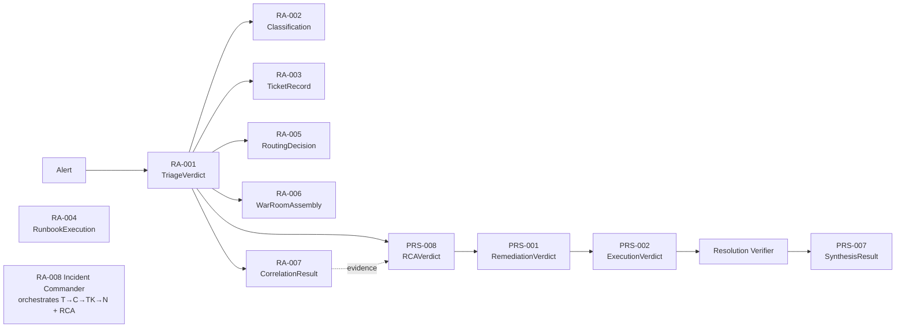

# Execution Traces — All Completed Agents

> Step-by-step execution analysis (reviewer format) for **every completed agent**, tracing one concrete incident through each. Each step records all seven dimensions in a compact table: **Step · What & Why · Inputs → Outputs · Tools/functions · Effect on next decision · Assumptions/issues.** Decision points are marked ◇.
>
> **Scenario (shared thread):** a payment outage. Where useful, the same `payment` incident flows agent-to-agent so you can see the data hand-offs.
>
> Deeper companions: [AGENT_EXECUTION_ANALYSIS.md](AGENT_EXECUTION_ANALYSIS.md) (full chain, RA-001 deep) · [EXECUTION_TRACE_RA005_PRS001.md](EXECUTION_TRACE_RA005_PRS001.md) (RA-005 + PRS-001, function-level) · [DEEP_DIVE_Notification_Router_and_Remediation_Recommender.md](DEEP_DIVE_Notification_Router_and_Remediation_Recommender.md) · [CODEBASE_INTERNALS.md](CODEBASE_INTERNALS.md).

## The completed agents (and where each runs)
| ID | Agent | Entry function | HITL | LLM? | Phase |
|---|---|---|---|---|---|
| RA-001 | Alert Triage | `triage(alert)` | None | severity+summary | Reactive |
| RA-002 | Incident Classifier | `classify(input)` | None | tier-2/3 | Reactive |
| RA-003 | Auto-Ticketing | `ticket(verdict)` | None | no | Reactive |
| RA-004 | Runbook Executor | `execute_runbook(incident)` | Required | no | Reactive |
| RA-005 | Notification Router | `route(verdict)` | None | no | Reactive |
| RA-006 | War-Room Assembler | `assemble(verdict)` | Optional | no | Reactive |
| RA-007 | Log Correlation | `correlate(input)` | None | summary | Reactive |
| RA-008 | Incident Commander | `command(alert)` | None | via RCA | Reactive (SRE) |
| PRS-008 | RCA Agent ★ | `analyze(verdict)` | Required | yes (Sonnet 4.6) | Prescriptive |
| PRS-001 | Remediation Recommender | `recommend(input)` | Required | no (pure) | Prescriptive |
| PRS-002 | Auto-Healer | `execute(request)` | Required | no | Prescriptive |
| PRS-007 | Knowledge Synthesizer | `synthesize(bundle)` | Required | postmortem | Prescriptive |
| — | Resolution Verifier | `verify(context)` | Required (close) | no | Prescriptive |

**Pipeline order (the chain):** `RA-001 → RA-002 → RA-003 → RA-005` (reactive flow); RA-008 wraps that + `RA-007` + `PRS-008`; then `PRS-008 → PRS-001 → PRS-002 → Resolution Verifier → PRS-007`. RA-004 and RA-006 are triggered for the relevant incidents.

---

## RA-001 — Alert Triage  ·  `triage(alert) -> (TriageVerdict, verdict_id)`
**Input:** raw `Alert{service:payment, metric:PaymentErrorRateHigh, severity_hint:critical, …}` (12 duplicates incoming).

| # | What & why | In → Out | Tools / funcs | Effect on next | Assumptions / issues |
|---|---|---|---|---|---|
| 1 | **Validate** the alert at the boundary | raw dict → `Alert` | pydantic validators | clean fields for all stages | rejects empty service / NaN |
| 2 | **Normalize** to canonical shape | `Alert` → `Alert` | source adapters | source-agnostic downstream | no-op on synthetic path |
| 3 ◇ | **Dedup** (idempotency 30s → cluster key → embedding ≥0.85) | alert+history → `_DedupHit{dup=12,new}` | `find_recent_verdict_by_alert_id`, `find_active_cluster`, `upsert_cluster`, embeddings | 12 alarms → 1 incident | embeddings off in CI; single inject = dup 1 |
| 4 | **Correlate** — pull metrics+traces | service → `metrics_ctx, traces_ctx` | `observability.metrics.query` + `traces.search` (parallel) | enriches severity+summary | degrades to empty if backend down |
| 5 ◇ | **Severity** rule-first, LLM if ambiguous | hint+ratio → `Sev-1, 0.95` | `_classify_severity_rule_based` → `_classify_severity_llm` | Sev-1 → page / war-room / IC | ⚠️ demo: severity from pre-set hint |
| 6 ◇ | **Ownership** — team + on-call | service → `Payments Team`, `chinmay@…` | `itsm.cmdb.lookup`, `oncall.schedule.lookup` | assignee for RA-005/RA-006 | CMDB demo fallback; sticky on first run |
| 7 ◇ | **Summary** LLM or template | ctx → one-line summary | `aiops.llm.complete` (+fallback) | reused by ticket/notify/RCA | LLM latency mitigated by bg task |
| 8 | **Assemble + persist** | all → `TriageVerdict` + `verdict_id` | `state.save_verdict` | `verdict_id` is the FK gating children | best-effort; None → skip child persist |

---

## RA-002 — Incident Classifier  ·  `classify(input) -> Classification`
**Input:** `ClassificationInput{alert, triage_verdict}` (payment, Sev-1).

| # | What & why | In → Out | Tools / funcs | Effect on next | Assumptions / issues |
|---|---|---|---|---|---|
| 1 | **Seed-if-empty** the history store (idempotent) | — → seeded | `ensure_seeded` | gives similarity something to match | one-shot per process |
| 2 | **Embed** the incident text | text → 384-d vector | `_get_embed_model` (all-MiniLM-L6-v2) | vector for search | embeddings off in tests → tier-4 |
| 3 | **Search** nearest past incidents | vector → top-5 (cosine) | `nearest_historical_incidents(k=5,min=0.6)` | candidates for the tier decision | brute-force SQLite (not pgvector) |
| 4 ◇ | **Tier decide** (1 sim≥0.85+top-3 agree → no LLM; 2 LLM+evidence; 3 LLM cold; 4 keyword) | candidates → `external_dependency, 0.91` | `_decide`, `_llm_classify`, `_rule_based_fallback` | type routes the ticket category | low history → tier-3/4, lower conf |
| 5 ◇ | **Re-query CMDB itself** (don't trust upstream) | service → team/oncall/deps | `itsm.cmdb.lookup`, `oncall.schedule.lookup`, `cmdb.dependencies` | self-contained verdict | re-checks ownership independently |
| 6 | **Persist + learn** (embed back) | classification → row | `save_historical_incident` | next similar incident matches better | closed-loop, no retrain |

---

## RA-003 — Auto-Ticketing  ·  `ticket(verdict, classification) -> TicketRecord`
**Input:** the Sev-1 payment verdict + classification.

| # | What & why | In → Out | Tools / funcs | Effect on next | Assumptions / issues |
|---|---|---|---|---|---|
| 1 ◇ | **Suppressed?** skip (no dup ticket) | status → branch | — | one incident = one ticket | Active here → proceed |
| 2 | **Severity → urgency** map | Sev-1 → urgency 1 (High) | constant map | sets ServiceNow urgency | Sev-1/2/3 → 1/2/3 |
| 3 | **Build payload** (desc blocks) | verdict+classification → fields | `_render` | the ticket body | — |
| 4 ◇ | **Create incident** (continue on error) | payload → `INC0012345` | `itsm.incident.create` (servicenow/mock) | ticket id flows to RCA-apply/verifier | SNOW unconfigured → mock id |
| 5 | **Attach Grafana panel** (mapped alerts) | alert → PNG attached | `observability.metrics.render_panel` + `itsm.incident.attachment.add` | evidence on the ticket | only for mapped alerts |
| 6 | **Notify** chat (handoff to RA-005 later) | → chat ping | `notify.send` | human sees it even if create failed | best-effort |

---

## RA-004 — Runbook Executor  ·  `execute_runbook(incident) -> RunbookExecution`  (HITL Required)
**Input:** `Incident{service:cart, severity:sev2, tags:[crashloop]}` (a runbook-eligible incident).

| # | What & why | In → Out | Tools / funcs | Effect on next | Assumptions / issues |
|---|---|---|---|---|---|
| 1 ◇ | **Select runbook** (service→tags→severity) | incident → runbook or None | `select_runbook` | None → `no_runbook`, stop | service is mandatory match |
| 2 | **Dry-run preview** every step | steps → simulate results | `automation.runbook.simulate` (NONE) | shows plan before acting | read-only |
| 3 ◇ | **Per step:** destructive→gate; else apply | step → executed/denied | `automation.runbook.execute` (REQUIRED) / `apply` (NONE) | gate-blocked → `denied`, stop | fail-closed: unmarked step = destructive |
| 4 ◇ | **On failure: rollback** prior steps in reverse | fail → `rolled_back` | `_call` (rollback action) | no half-applied state | rollback action must exist |
| 5 | **Finalize status** | → `resolved` / `rolled_back` / `failed` / `denied` | — | RunbookExecution returned | execution mocked in v0 (real files now seeded) |

---

## RA-005 — Notification Router  ·  `route(verdict) -> RoutingOutcome`  *(compact — full trace in [EXECUTION_TRACE_RA005_PRS001.md](EXECUTION_TRACE_RA005_PRS001.md))*
**Input:** Sev-1 payment verdict, clock 02:00 UTC.

| # | What & why | In → Out | Tools / funcs | Effect on next | Assumptions / issues |
|---|---|---|---|---|---|
| 1 | **Time context** (UTC business hours) | hour 2 → `in_hours=False` | `_is_business_hours` | feeds response mode | fixed UTC window |
| 2 | **Tokenize** for sub-domain | text → `[payment,gateway,5xx,…]` | `_category_keywords_for` (regex) | feeds on-call match | lexical, not semantic |
| 3 ◇ | **Resolve on-call** (sticky/expertise) | team+keywords → Chinmay, "Payment Gateway" | `oncall.schedule.lookup` | mentions+assignee+body | None tolerated |
| 4 ◇ | **Severity branch** | Sev-1 → P1, `incidents`, `[page_oncall,post_to_chat]` | the if-ladder | actions drive which adapters fire | inherits RA-001 severity |
| 5 | **Response mode** | (Sev-1,off-hrs) → `page` | `_response_mode` | DM mode + badge | — |
| 6 ◇ | **Fan-out emit** | ChatMessage → deliveries | `ChatOpsClient.send` → jsonfile/ws/slack/slack_bot/pagerduty | page everywhere | per-sink isolation |
| 7 | **Persist** | → `NotificationRow` | `save_notification` | dashboard backfill | FK-guarded |

---

## RA-006 — War-Room Assembler  ·  `assemble(verdict) -> WarRoomOutcome`
**Input:** Sev-1 payment verdict (incident_id INC0012345).

| # | What & why | In → Out | Tools / funcs | Effect on next | Assumptions / issues |
|---|---|---|---|---|---|
| 1 ◇ | **Severity gate** (Sev-1/2 only) | Sev-1 → proceed | `_WAR_ROOM_SEVERITIES` | Sev-3/4 → `assembled=False` | no-op below Sev-2 |
| 2 | **Resolve SME** (on-call only, v1) | team → Chinmay | `oncall.schedule.lookup` | who to invite | CMDB/dependency owners = v2 |
| 3 | **Channel name** | incident_id → `war-room-INC0012345` | `_slug`/`_channel_name` | stable bridge id | prefers incident_id over service |
| 4 | **Context pack** (live telemetry, parallel) | service → metrics+traces lines | `observability.metrics.query` + `traces.search` | responders walk in informed | degrades to "unavailable" offline |
| 5 ◇ | **Create bridge** (Slack + Jitsi) | → channel + meeting URL | `chatops.war_room.create` (conversations.create/invite/postMessage) | SMEs click to join | simulates without bot token |
| 6 | **Seed timeline** | events → timeline[] | — | RA-007/IC append later | — |

---

## RA-007 — Log Correlation  ·  `correlate(input) -> CorrelationResult`
**Input:** `CorrelationInput{service:payment, window, triage_verdict?}`.

| # | What & why | In → Out | Tools / funcs | Effect on next | Assumptions / issues |
|---|---|---|---|---|---|
| 1 | **Resolve topology** (payload or CMDB) | service → deps map | `itsm.cmdb.dependencies` | topology-aware blame | explicit topology wins |
| 2 | **Fan-out fetch** logs/traces/metrics | window → raw signals | `observability.logs/traces/metrics` (ThreadPool) | evidence to correlate | parallel; degrades offline |
| 3 ◇ | **Synthetic fallback** if empty/offline | empty → deterministic signals | `_synthesize_signals` | demo still flows | clearly tagged `synthetic` |
| 4 | **Rule correlate** (fingerprint, timeline, first-error, spike) | signals → timeline+signatures | `_fingerprint`, `_error_rate_spike` (≥3) | suspect ranking | rules, not ML |
| 5 ◇ | **Name suspects** (topology-aware) | timeline+deps → `[database]` | `_suspects_from_topology` | the culprit list | depends on dep map quality |
| 6 | **LLM summary** (template fallback) | suspects → headline | `aiops.llm.complete` | feeds RCA evidence | falls back to template |

---

## RA-008 — Incident Commander  ·  `command(alert) -> IncidentCommandResult`  (SRE)
**Input:** the firing payment `Alert` (Sev-1).

| # | What & why | In → Out | Tools / funcs | Effect on next | Assumptions / issues |
|---|---|---|---|---|---|
| 1 | **Run reactive flow** (one call) | alert → verdict+classification+ticket+notify | `run_reactive_flow` | full reactive result | chains RA-001/002/003/005 |
| 2 ◇ | **Correlate** | — | *traced placeholder* | reserved seam | ⚠️ RA-007 not wired here yet |
| 3 ◇ | **Severity gate** (engage Sev-1/2) | Sev-1 → engage | `_COORDINATED_SEVERITIES` | below → `engaged=False`, stop | reactive still ran |
| 4 | **RCA** (read-only) | verdict → `RCAVerdict` | `rca_analyze` | cause + fix steps | never executes a fix |
| 5 | **Coordinate** (comms + handoff) | → IC context pack + human-IC request | `chatops.get_client().send` | a human takes command | single beat; cadence/status-page deferred |
| 6 | **Postmortem seed** | facts → `PostmortemSeed` | — | PRS-007 finishes it later | facts-only |

---

## PRS-008 — RCA Agent ★  ·  `analyze(triage_verdict) -> RCAVerdict`  (HITL Required)
**Input:** the Sev-1 payment verdict (+ optional RA-007 correlation).

| # | What & why | In → Out | Tools / funcs | Effect on next | Assumptions / issues |
|---|---|---|---|---|---|
| 1 | **Validate** input | dict → `RCAInput` | pydantic | clean prompt input | — |
| 2 | **Render prompt** (+correlation evidence) | verdict → user prompt | `_render_user_prompt` | LLM context | evidence optional/additive |
| 3 ◇ | **LLM reason** (JSON mode, Claude Sonnet 4.6) | prompt → JSON | `aiops.llm.complete` (provider=anthropic) | the root cause + steps | Azure filter avoided by Foundry route |
| 4 | **Parse + validate** | text → `RCAVerdict` | `_extract_json_object` | structured verdict | regex-extract guards malformed JSON |
| 5 | **Force `requires_hitl=True`** on every step | steps → gated steps | `Literal[True]` | platform gate will enforce | un-overridable invariant |
| 6 ◇ | **Fallback** if LLM down/unparseable | → deterministic (locked) or low-conf | `_fallback_verdict` | safe answer for `slow-product-catalog`; else "investigate" | confident only on injectable-flag scenarios |

*(Execution of a fix step is separate: `rca.fix_step.execute` — REQUIRED gate — flips the flag only after approval.)*

---

## PRS-001 — Remediation Recommender  ·  `recommend(input) -> RemediationVerdict`  *(compact — full trace in [EXECUTION_TRACE_RA005_PRS001.md](EXECUTION_TRACE_RA005_PRS001.md))*
**Input:** the payment `RCAVerdict` (root cause = gateway external dependency).

| # | What & why | In → Out | Tools / funcs | Effect on next | Assumptions / issues |
|---|---|---|---|---|---|
| 1 | **Extract** rca fields | verdict → service/cause/steps | — | scoring inputs | reads dict (loose coupling) |
| 2 | **Options from RCA steps** (conf decay) | step → `rca-step-1` (set_flag, low, 0.9) | `_option_from_rca_step` | option pool | flag flips = rollback_tested |
| 3 ◇ | **Catalog match** (substring AND) | cause → `external-fail-open` | `patterns_for_cause` | extra mitigations | misses if cause lacks keywords |
| 4 ◇ | **Composite score** (safety-dominant) | options → scores (62.5 vs 61.25) | `_composite_score` | the ranking | `(6−blast)*10 + conf*5 + …` |
| 5 ◇ | **Sort + recommend** | → #1 `rca-step-1` | `sort` | operator's default | `auto_pick_eligible=False` |
| 6 | **Verdict** (mean top-3 conf) | → `RemediationVerdict` (0.775) | — | dashboard menu | pure; no I/O |

---

## PRS-002 — Auto-Healer  ·  `execute(request) -> ExecutionVerdict`  (HITL Required)
**Input:** the chosen `RemediationOption` (set_flag paymentFailure→off) + service.

| # | What & why | In → Out | Tools / funcs | Effect on next | Assumptions / issues |
|---|---|---|---|---|---|
| 1 ◇ | **Validate option** (requires_hitl, tool_capability) | option → ok/refused | `_validate_option` | bad → `REFUSED`, gate never reached | refuses unsafe/malformed |
| 2 ◇ | **Enforce HITL gate** | ctx → Decision or GateError | `get_gate().enforce("auto_heal.lite.execute")` | the "do it" line is unreachable until approved | platform-enforced |
| 3 ◇ | **Branch:** denied / dry-run / live | gate → status | — | `BLOCKED` / `DRY_RUN_OK` / dispatch | dry-run is default-safe |
| 4 ◇ | **Dispatch tool** (live only) | → tool result | `registry.call(feature_flags.set_variant)` | `EXECUTED`/`EXECUTION_FAILED` → flag flips, payment heals | only flag-flips truly run today |
| 5 | **Persist** every attempt | verdict → `ExecutionRow` | `save_execution` | audit + future learning | best-effort |

---

## Resolution Verifier  ·  `verify(context)`  (companion; HITL on close)
**Input:** the applied fix + ticket id (post Auto-Healer).

| # | What & why | In → Out | Tools / funcs | Effect on next | Assumptions / issues |
|---|---|---|---|---|---|
| 1 | **Re-run detection checks** across windows (1/3/5m) | metric → CheckResult[] | `observability.metrics.query` | proof the fix held | stabilization windows |
| 2 ◇ | **Pass?** attach proof + raise close approval | results → close card | `itsm.incident.update`, `itsm.ticket.close` (REQUIRED) | human approves close | gated |
| 3 ◇ | **Fail?** notify | → alert | `notify.send` | re-engage responders | no auto-rollback in v0 |

---

## PRS-007 — Knowledge Synthesizer  ·  `synthesize(bundle) -> SynthesisResult`  (HITL on publish)
**Input:** resolved-incident bundle (verdict + RCA + ticket).

| # | What & why | In → Out | Tools / funcs | Effect on next | Assumptions / issues |
|---|---|---|---|---|---|
| 1 ◇ | **Idempotency** (already synthesized?) | incident_id → existing/none | `find_kb_by_incident_id` | avoid duplicates | most-recent wins |
| 2 | **Build timeline** (cross-agent) | audit ts → timeline | `_build_timeline` | postmortem structure | — |
| 3 ◇ | **Draft postmortem** (LLM/template) | bundle → postmortem | `aiops.llm.complete` (+fallback) | the narrative | deterministic fallback |
| 4 | **Suggest runbook** (new/update) | RCA steps → suggestion | `_runbook_suggestion` | feeds runbook library | new vs update mode |
| 5 | **Redact PII/secrets** | text → redacted | `redaction.redact` | safe to store | regex-grade (not compliance) |
| 6 ◇ | **Dedup** (cosine / Jaccard) | article → create/duplicate | `_dedup_check`, `nearest_kb_articles` | avoid near-duplicate KB | embeddings optional |
| 7 | **Persist pending_review** | → `KBArticleRow` | `save_kb_article` | awaits `knowledge.publish` (REQUIRED) | publish gated by human |

---

## Consolidated — cross-agent data flow

## Global decision points (the branches that change the run)
| Agent | Decision | Drives |
|---|---|---|
| RA-001 | dedup new/merge/idempotent; severity rule vs LLM | how many incidents; page vs not |
| RA-002 | similarity tier 1–4 | type + which team |
| RA-003 | suppressed skip; urgency | ticket or not |
| RA-004 | runbook match; destructive→gate; fail→rollback | resolved/denied/rolled_back |
| RA-005 | severity branch; response mode | page/notify/log + which sinks |
| RA-006 | severity gate; bridge create | war room or no-op |
| RA-007 | live vs synthetic; topology suspects | named culprit |
| RA-008 | severity gate engage | full coordination or pass-through |
| PRS-008 | LLM vs fallback | executable fix vs investigate |
| PRS-001 | catalog match; composite score | which option recommended |
| PRS-002 | validate; gate; dry/live | refused/blocked/dry_run_ok/executed |
| Verifier | checks pass/fail | close vs re-engage |
| PRS-007 | idempotency; dedup | new KB or skip |

## Global assumptions & risks
| Area | Risk | Severity |
|---|---|---|
| Severity source | demo uses pre-set hint/flag map, not real metrics | High (prod realism) |
| Alert source | UI synthesizes alerts (OTel spans STATUS_CODE_UNSET) | Medium |
| Embeddings/vector | optional + SQLite brute-force (not pgvector) | Medium |
| RCA coverage | confident only on injectable-flag scenarios; no own RAG | Medium |
| Auto-Healer breadth | only flag-flips execute; no auto-rollback | Medium |
| IC ↔ RA-007 | correlation placeholder in IC | Low–Medium |
| HITL | enforced at platform boundary, un-bypassable | Strength |

**Verdict:** the reactive agents (RA-001/002/003/005/006/007) and PRS-001 are deterministic/rule-or-score based; only RA-001 (severity+summary), RA-002 (tier-2/3), RA-007 (summary), PRS-008 (core), PRS-007 (postmortem) use the LLM. Every state-changing action (runbook execute, RCA fix, auto-heal, ticket close, KB publish) sits behind the platform HITL gate. Demo shortcuts are confined to the *signal source* and *severity derivation*; the agent logic and the safety gate are real.

---

*Companion to [AGENT_EXECUTION_ANALYSIS.md](AGENT_EXECUTION_ANALYSIS.md), [EXECUTION_TRACE_RA005_PRS001.md](EXECUTION_TRACE_RA005_PRS001.md), [DEEP_DIVE_Notification_Router_and_Remediation_Recommender.md](DEEP_DIVE_Notification_Router_and_Remediation_Recommender.md), [PROJECT_OVERVIEW.md](PROJECT_OVERVIEW.md), [CODEBASE_INTERNALS.md](CODEBASE_INTERNALS.md).*
